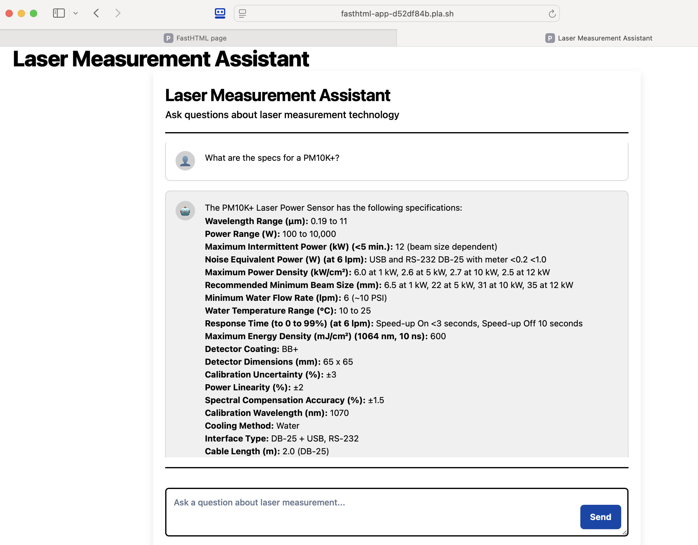

# Laser Measurement Assistant

A FastHTML application providing an intelligent chat interface to answer technical questions about laser measurement products (power meters, energy meters, beam diagnostics) by querying product datasheets.

*   **[View Detailed Project Summary & Workflow (Gist)](https://gist.github.com/seaberger/4ec4b87fdbef374d086bc8c326af1153)**



## Overview

This project implements a Retrieval-Augmented Generation (RAG) pipeline to transform complex PDF datasheets into a searchable knowledge base. Users can ask technical questions in natural language, and the system retrieves relevant information from the datasheets to generate accurate answers using a Large Language Model (LLM).

## Key Features

*   **Intuitive Chat Interface:** Clean, responsive UI built with FastHTML and HTMX.
*   **Advanced PDF Parsing:** Uses LlamaParse to accurately extract text and structured data (like model/part number pairs) from datasheets.
*   **Hybrid Retrieval:** Combines semantic vector search (Qdrant) and precise keyword search (SQLite FTS5) for optimal information retrieval based on the query type.
*   **Contextual Enrichment:** Nodes are enriched with keywords and summaries using an LLM (gpt-4o-mini).
*   **Dynamic Query Analysis:** Adapts retrieval strategy (vector vs. keyword bias, metadata boosting) based on whether the query contains part numbers, models, or general terms.
*   **High-Quality Reranking:** Uses Cohere Rerank to ensure the most relevant context is passed to the LLM.
*   **Conversational Memory:** Remembers previous turns in the conversation.
*   **Markdown Support:** Renders formatted responses, including code blocks.

## Technology Stack

*   **Core RAG Framework:** LlamaIndex
*   **PDF Parsing:** LlamaParse (Cloud Service)
*   **LLMs & Embeddings:** OpenAI (gpt-4o, gpt-4o-mini, text-embedding-3-large)
*   **Reranking:** Cohere API
*   **Vector Store:** Qdrant (in-memory by default)
*   **Keyword Index:** SQLite (FTS5)
*   **Web Framework:** FastHTML / HTMX
*   **Language:** Python

## Workflow Stages

The core workflow involves several stages (detailed in the [Project Summary Gist](https://gist.github.com/seaberger/4ec4b87fdbef374d086bc8c326af1153)):

1.  **Data Ingestion (`parse.py`):** Parse PDFs using LlamaParse, extract text and model/part pairs metadata.
2.  **Node Enrichment (`metadata.py`):** Split documents into nodes, generate context keywords using an LLM.
3.  **Indexing (`chat_engine.py` - setup):** Build SQLite FTS5 index and Qdrant vector index.
4.  **Retrieval Setup (`chat_engine.py` - retriever):** Configure hybrid retriever with query analysis, dynamic weighting, and Cohere reranking.
5.  **Chat Engine (`chat_engine.py` - engine):** Initialize LlamaIndex `ContextChatEngine` with the hybrid retriever and memory.
6.  **Web Interface (`main.py`):** Run the FastHTML application for user interaction.

## Setup & Installation

1.  **Prerequisites:**
    *   Python 3.9+
    *   Git

2.  **Clone the Repository:**
    ```bash
    git clone <your-repo-url>
    cd <your-repo-directory>
    ```

3.  **Create a Virtual Environment (Recommended):**
    ```bash
    python -m venv venv
    source venv/bin/activate  # On Windows use `venv\Scripts\activate`
    ```

4.  **Install Dependencies:**
    *   Ensure you have a `requirements.txt` file in your repository.
    ```bash
    pip install -r requirements.txt
    ```

5.  **Set Up API Keys:**
    *   You will need API keys from OpenAI, Cohere, and potentially LlamaCloud (for LlamaParse).
    *   Create a `.env` file in the root of the project directory.
    *   Add your keys to the `.env` file:
        ```dotenv
        OPENAI_API_KEY="sk-..."
        COHERE_API_KEY="..."
        LLAMA_CLOUD_API_KEY="..." # If using LlamaParse cloud
        ```
    *   The application code (likely in `chat_engine.py` or similar) should load these variables (e.g., using `python-dotenv`).

6.  **Prepare Data:**
    *   Place your PDF product datasheets into the designated input directory (e.g., `./datasheets/`).
    *   Run the data processing scripts in order:
        ```bash
        python parse.py
        python metadata.py
        ```
    *   This will generate the necessary `.pkl` files and potentially the `laser_nodes.db` SQLite database used by the chat engine. *Note: The indexing might also happen on the first run of the chat engine itself, check your `chat_engine.py` logic.*

## Running the Application

1.  **Start the FastHTML Server:**
    ```bash
    python main.py
    ```
    *(Adjust the command if your main entry point script is named differently)*

2.  **Access the Chatbot:** Open your web browser and navigate to the address provided (usually `http://127.0.0.1:8000` or similar).

## Deployment

This application can be deployed using services compatible with Python web applications, such as Plash (as mentioned previously), Heroku, Render, or directly on a VPS. Ensure environment variables (API keys) are set correctly in the deployment environment.

## License

[Specify Your License Here - e.g., MIT, Apache 2.0, None (Proprietary)]